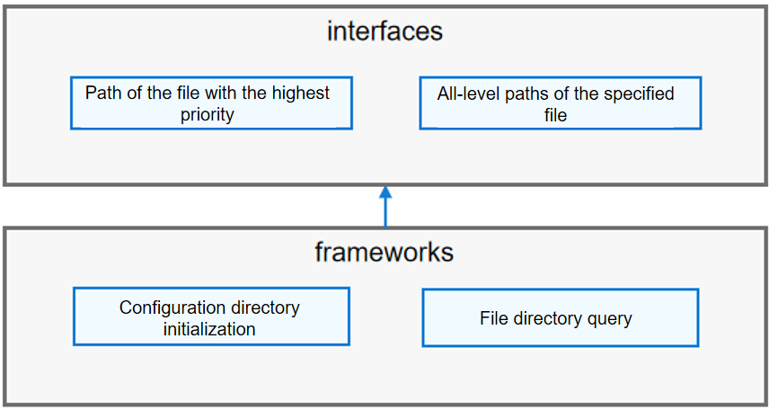

# Configuration Policy Component

## Introduction

The configuration policy component, namely, customization_config_policy, provides APIs for each service module to obtain the configuration directories at different levels or the configuration file paths.

## System Architecture

**Figure 1** Architecture of the configuration policy component



The architecture is described as follows:

- **interfaces** provides the path of the file with the highest priority and all-level paths of the specified file.
- **frameworks** initializes the configuration directory and queries the file path.

## Directory Structure

The code directory structure of the configuration policy component is as follows:

```
/base/customization/
├── config_policy           # Code repository for the configuration policy component
│   ├── frameworks          # Core code of the configuration policy component
│   │   ├── config_policy   # Configuration policy module
│   │   │   └── src         # Implementation code
│   ├── interfaces          # APIs of the configuration policy component
│   │   ├── inner_api       # APIs for internal subsystems
│   │   └── kits            # JavaScript APIs of the configurationpolicy component
│   └── test                # Test code
```

## Usage

Call the APIs of the configuration policy component to obtain the configuration directories at different levels or the configuration file paths.

```
#include "config_policy_utils.h"

CfgDir *cfgDir = GetCfgDirList(); // Obtain the configuration directory list.
FreeCfgDirList(cfgDir); // Release the memory after the list is obtained.

const char *cfgPath = "etc/xml/cfg.xml"; // Set the relative path and name of the configuration file.
CfgFiles *cfgFiles = GetCfgFiles(cfgPath); // Obtain the configuration file paths of all configuration levels.
FreeCfgFiles(cfgFiles); // Release the memory after the information is obtained.

const char *userPath = "etc/xml/user.xml"; // Set the relative path and name of the configuration file.
char buf[MAX_PATH_LEN] = {0};
char *filePath = GetOneCfgFile(userPath, buf, MAX_PATH_LEN); // Obtain the path of the configuration file with the highest priority.
```

## Constraints

**Programming language**: C/C++

## Repositories Involved

**customization\_config\_policy**
