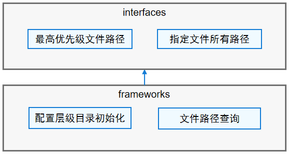

# 配置策略组件介绍

## 简介

配置策略组件为各业务模块提供获取各配置层级的配置目录或配置文件路径的接口。

## 系统架构

**图 1**  配置策略组件架构图 



配置策略组件架构图说明：

- interfaces对外提供指定文件的最高优先级文件路径以及指定文件所有层级路径。
- frameworks实现配置层级目录的初始化与文件路径查询。

## 目录

配置策略组件源代码目录结构如下所示：

```
/base/customization/
├── config_policy           # 配置策略代码仓
│   ├── frameworks          # 配置策略核心代码
│   │   ├── config_policy   # 配置策略模块
│   │   │   └── src         # 实现代码
│   ├── interfaces          # 配置策略接口
│   │   ├── innerkits       # 子系统间接口
│   │   └── kits            # 配置策略JavaScript接口
│   └── test                # 测试代码
```

## 说明

调用该组件中的接口获取各配置层级的配置目录或配置文件路径。

```
#include "config_policy_utils.h"

const char *testPathSuffix = "user.xml"; //设置配置文件名称
char buf[MAX_PATH_LEN];
char *filePath = GetOneCfgFile(testPathSuffix, buf, MAX_PATH_LEN); //获取最高优先级的配置文件路径
```

## 约束

**语言限制**：C/C++语言

## 相关仓

**customization\_config\_policy**

